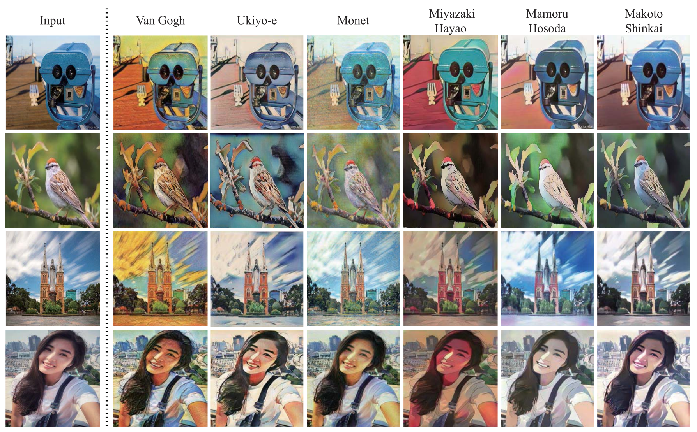

## SDP-GAN: Saliency Detail Preservation Generative Adversarial Networks for High Perceptual Quality Style Transfer

This is the Pytorch implementation of our TIP 2020 paper [SDP-GAN](http://liushuaicheng.org/TIP/SDPGAN/SDPGAN-TIP.pdf).


## Dependencies

* Python=3.5
* Pytorch>=1.1.0
* Other requirements please refer to requirements.txt.

## Data Preparation

Considering the copyright, we do not provide the links of our dataset. The composition of our dataset is described as follows:

### Source dataset

The source dataset is composed of two parts:
* the source images of [CycleGAN](https://github.com/junyanz/pytorch-CycleGAN-and-pix2pix); 
* our collection from movies or from the Internet. 

The CycleGAN dataset includes many landscape pictures with relatively uniform content, therefore, we gather images from movies or from the Internet that own clear salient objects.

### Target dataset

The target dataset contains six different styles:
* Van Gogh, Ukiyo-e and Monet styles originate from [CycleGAN](https://github.com/junyanz/pytorch-CycleGAN-and-pix2pix);
* Miyazaki Hayao, Makoto Shinkai and Mamoru Hosoda styles are captured from corresponding movies.

### The contents of directories

```
./dataset/
├── src_data
│   ├── train_com
│   │   └──*.jpg
│   └── test_com
│       └──*.jpg
└── tgt_data
    ├── train
    │   └──*.jpg
    └── pair
        └──*.jpg
```

* `train_com` is the combination of source training RGB image and corresponding salient image;
* `test_com` is the combination of source testing RGB image and corresponding salient image;
* `train` is the target style image;
* `pair` is the combination of target style image and corresponding blur image.

The salient images are the average of two saliency detection methods:
* [robust background saliency detection (RBD)](https://openaccess.thecvf.com/content_cvpr_2014/papers/Zhu_Saliency_Optimization_from_2014_CVPR_paper.pdf);
* [minimum barrier salient object detection (MBD)](https://openaccess.thecvf.com/content_iccv_2015/papers/Zhang_Minimum_Barrier_Salient_ICCV_2015_paper.pdf).
[Pytorch code](https://github.com/yhenon/pyimgsaliency)

We provide an example of these four folders:


Please prepare the `train_com`, the `test_com` and the `train` folders before training. The `pair` folder will be automatically generated through the `edge_promoting` function in `train.py`.


## Pre-trained models

The pre-trained models can be downloaded [here](https://drive.google.com/drive/folders/1agSGUuK0LuwLuxzqXADGdRa2rvD_CyWu?usp=sharing). Place the models in ./pretrained_models to test it.

## Training
``` 
python3 train.py --name your_experiment_name --src_data path/to/source/data --tgt_data path/to/target/data --vgg_model path/to/vgg19/model
```

## Testing

```
python3 test.py
```

## Results



## Citation

```
@article{li2020sdp-gan,
  title={SDP-GAN: Saliency Detail Preservation Generative Adversarial Networks for High Perceptual Quality Style Transfer},
  author={Li, Ru and Wu, Chi-Hao and Liu, Shuaicheng and Wang, Jue and Wang, Guangfu and Liu, Guanghui and Zeng, Bing},
  journal={IEEE Transactions on Image Processing},
  volume={30},
  pages={374--385},
  year={2020},
  publisher={IEEE}
}
```

# Acknowledgments

In this project we use (parts of) the implementations of the following works:

* [CartoonGAN-Test-Pytorch-Torch](https://github.com/Yijunmaverick/CartoonGAN-Test-Pytorch-Torch)
* [Pytorch-CartoonGAN](https://github.com/znxlwm/pytorch-CartoonGAN) 

We thank the respective authors for open sourcing of their implementations.
